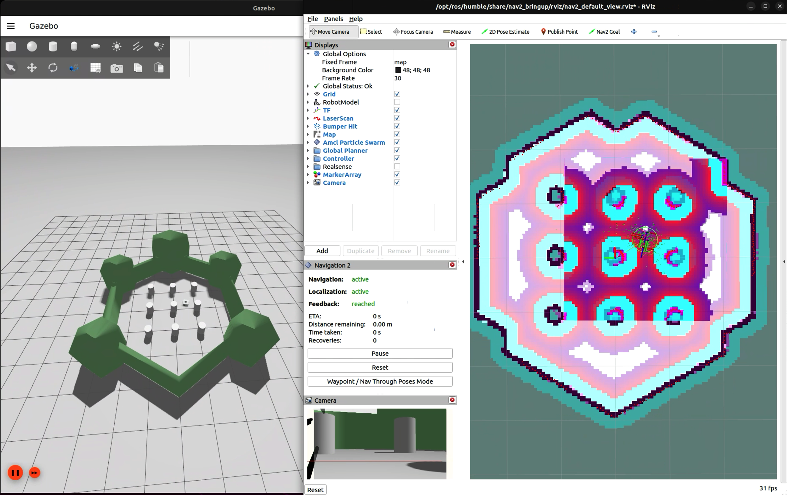

# navigation2_ignition_gazebo_turtlebot3
Using Nav2 for navigating a simulated Turtlebot 3 in the Ignition Gazebo simulator.

`ROS_LOCALHOST_ONLY=1 TURTLEBOT3_MODEL=waffle ros2 launch turtlebot3 simulation.launch.py` to launch simulation, nav2, and rviz2 simultaneously.

`/odom` topic, `odom` frame, and `/odom/tf` (tf topic) are defined in `model.sdf`.  The transformation of `base_footprint` in the odom frame is published through `/odom/tf`.  `/odom` topic publishes the transformation of odom frame in the `map` frame.

Use `ros2 run tf2_tools view_frames` to see the tf frame relations.

Ign gazebo publishes `joint_states`, which is then translated to ROS2 topic via `ros_ign_bridge`, and consumed by `robot_state_publisher` (a ROS2 node) for computing/publishing most of tf.

`/odom/tf` is remapped to `/tf`.

Ign gazebo topics are translated to/from ROS2 topics via `ros_ign_bridge`.

`nav2_bringup` is called to initiate basic services and configurations.

Tested with Ignition Gazebo Fortress and ROS2 Humble.

Requires
  - `ros-<distro>-navigation2`
  - `ros-<distro>-nav2-bringup`
  - `ros-<distro>-ros-ign-gazebo`
  - `ros-<distro>-ros-ign-bridge`
